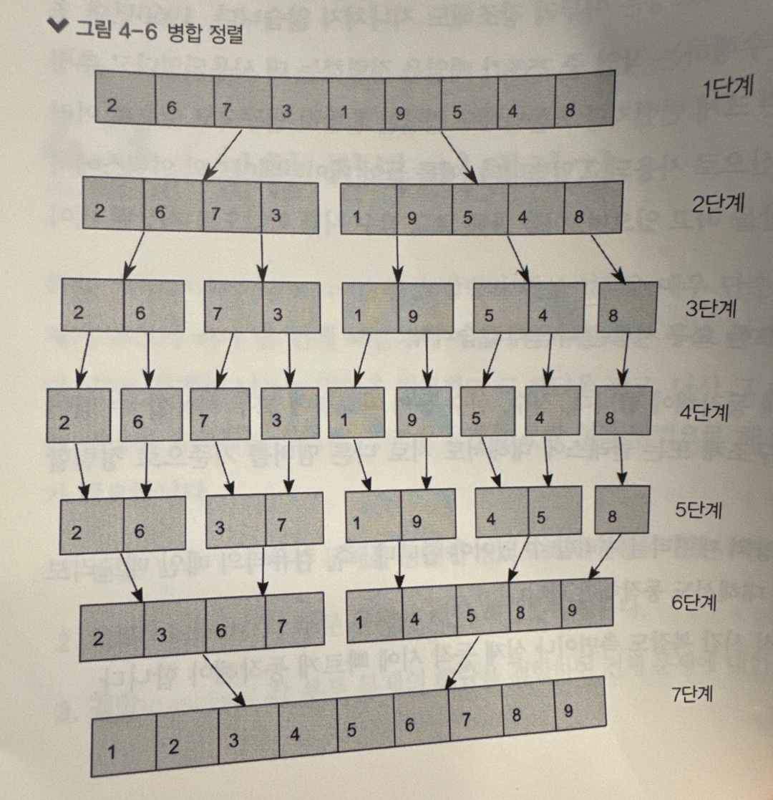
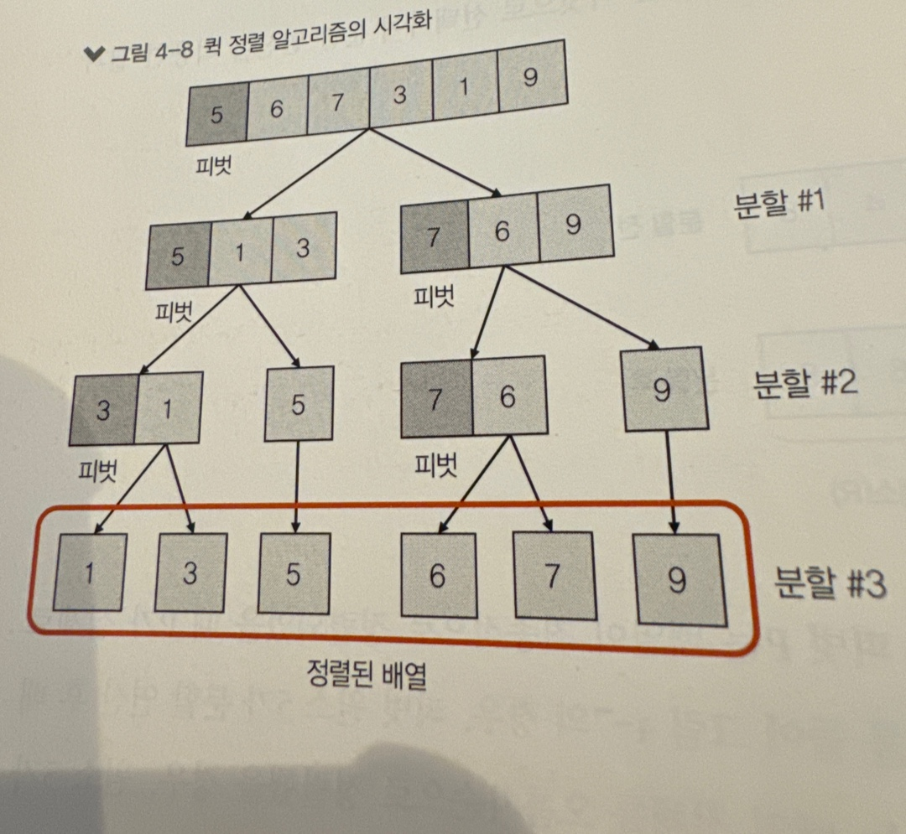

# 분할 정복
분할 정복을 알면
* 이진 검색, 병합 정렬, 퀵 정렬, 행렬 검색, 선형 시간 선택 등의 대표적인 분할 정복 알고리즘 구현 가능
* 맵리듀스 프로그래밍 모델을 사용하여 문제 해결 가능
* 멀티스레드를 사용하는 C++ 맵리듀스 라이브러리의 사용 방법을 배울 수 있다.
```
분할 정복 유형의 알고리즘은 주어진 문제를 작은 부분 문제로 나누고,
나눠진 각 부분 문제의 솔루션을 구하고, 
각 부분 문제 솔루션을 합쳐서 전체 문제에 대한 솔루션을 구하는 방식
```
* 분할 정복의 3단계
    * 분할(divide) : 주어진 문제를 동일한 방식으로 해결할 수 있는 여러 부분 문제로 나눈다.
    * 정복(conquer) : 각 부분 문제에 대한 해답을 구한다.
    * 결합(combine) : 각 부분 문제의 해답을 결합하여 전체 문제에 대한 해답을 구한다.
## 분할 정복 기법과 C++표줌 라이브러리 함수
* 아래 설명하는 함수의 동작을 직접 구현할 필요 없이 c++에서는 아래 표 처럼 미리 정의된 유용한 알고리즘 함수 제공함
<table>
	<tr>
		<th>STL 함수</th>
		<th>함수 설명</th>
	</tr>
	<tr>
		<td>std::binary_search()</td>
		<td>이진 검색을 이용하여 컨테이너에서 원소 하나를 찾는다.</td>
	</tr>
	<tr>
		<td>std::search()</td>
		<td>컨테이너에서 일련의 원소들을 찾는다.</td>
	</tr>
	<tr>
		<td>std::upper_bound()</td>
		<td>컨테이너에서 주어진 값보다 큰 원소가 나타나기 시작하는 위치의 반복자를 반환한다.</td>
	</tr>
	<tr>
		<td>std::lower_bound()</td>
		<td>컨테이너에서 주어진 값보다 작은 원소가 나타나기 시작하는 위치의 반복자를 반환한다.</td>
	</tr>
	<tr>
		<td>std::partition()</td>
		<td>분할 연산을 수행하고, 주어진 피벗보다 작은 원소는 피벗 왼쪽으로 옮기고 피벗보다 큰 원소는 피벗 오른쪽으로 옮긴다.</td>
	</tr>
	<tr>
		<td>std::partition_copy()</td>
		<td>분할 연산을 수행하고, 그 결과를 별도의 두 배열로 반환함.</td>
	</tr>
	<tr>
		<td>std::is_partitioned()</td>
		<td>주어진 피벗을 기준으로 분할이 되어 있는지를 검사.</td>
	</tr>
	<tr>
		<td>std::stable_partition()</td>
		<td>분할 연산을 수행하며, 각 파티션 원소는 원본 순서를 유지함.</td>
	</tr>
	<tr>
		<td>std::sort()</td>
		<td>컨테이너 원소를 정렬한다. 내부적으로 여러 정렬 알고리즘을 조합하여 사용한다.</td>
	</tr>
	<tr>
		<td>std::stable_sort()</td>
		<td>컨테이너 원소를 정렬하되, 서로 순위가 같은 원소에 대해 원본 순서가 변경되지 않도록 정렬함.</td>
	</tr>
	<tr>
		<td>std::partial_sort()</td>
		<td>컨테이너 전체가 아니라 일부 구간에 대해서 정렬한다.</td>
	</tr>
	<tr>
		<td>std::merge()</td>
		<td>두 개의 입력 컨테이너를 합친다. 이때 두 컨테이너의 원소 순서는 그대로 유지된다.</td>
	</tr>
	<tr>
		<td>std::nth_element()</td>
		<td>컨테이너에서 n번째로 작은 원소를 반환한다.</td>
	</tr>
	<tr>
		<td>std::accumulate()</td>
		<td>컨테이너 원소의 누적 합을 계산한다. 이 함수는 다른 외부 함수를 지정하여 누적 합이 아닌 다른 연산을 수행할 수도 있다.</td>
	</tr>
	<tr>
		<td>std::transform()</td>
		<td>컨테이너와 함수가 주어지면, 컨테이너의 모든 원소에 대해 해당 함수를 적용하여 값을 수정함.</td>
	</tr>
	<tr>
		<td>std::reduce()</td>
		<td>지정한 범위의 원소에 대해 리듀스 연산을 수행하고 결과를 반환함.</td>
	</tr>
</table>


## 이진 검색
* 각 단계에서 전체 시퀀스의 일부에 대해서만 검색을 수행
* 원소를 찾았거단 또는 range(일부분의 시퀀스)를 더 작은 부분으로 나눌 수 없을 때 검색을 종료함.
* **이진 검색은 대부분의 분할 정복 알고리즘과 조금 다른면이 있다.** 
    * 검색 문제에서는 시퀀스의 작은 range에서 원소를 찾을 수 있다면 전체 시퀀스에서도 원소를 찾을 수 있다. => 전체의 일부에서 구한 해답이 전체에서 구한 해답과 같다. 즉, **결합 과정이 필요하지 않음**. 이러한 특성은 분할 정복을 이용하여 해결할 수 있는 다수의 계산 문제에서 흔치 않은 경우이다.
```c++
	bool binary_search(int N, std::vector<int>& S)
	{
		auto first = S.begin();
		auto last = S.end();

		while (true)
		{
			// 현재 검색 범위의 중간 원소를 mid_element에 저장
			auto range_length = std::distance(first, last);
			auto mid_element_index = std::floor(range_length / 2);
			auto mid_element = *(first + mid_element_index);

			// mid_element와 N 값을 비교
			if (mid_element == N)
				return true;
			else if (mid_element > N)
				std::advance(last, -mid_element_index);
			else
				std::advance(first, mid_element_index);

			// 현재 검색 범위에 하나의 원소만 남아 있다면 false를 반환
			if (range_length == 1)
				return false;
		}
	}
```
## 분할 정복을 이용한 정렬 알고리즘
* 외부 정렬 : 컴퓨터의 메인 메모리에 데이터가 상주하지 않은 상태에서 수행되는 정렬을 필요로 함. 실행 중 임의 시점에서 전체 데이터의 일부만 메모리에 올려놓고 동작할 수 있다.
    * 병합 정렬
### 병합 정렬
* 목적 : 대용량의 데이터를 정렬하는 것
* 많은 원소로 구성된 전체 집합을 작은 크기의 부분집합으로 나눠 각각을 정렬하고, 정렬된 부분집합을 오름차순 또는 내림차순 순서를 유지하면서 합치는 방식
* 전체 배열을 여러 개의 부분 배열로 나누는 작업을 반복하며, 이 작업은 각 부분 배열이 하나의 원소만 가질 때 멈춤. 이후에는 **다시 배열을 합치는 작업을 반복하며 이때 <span style="color: black; background-color: yellow;">합쳐진 배열의 원소가 오름차순(내림차순)을 유지하도록 조정</span>**

```c++
	template <typename T>
	std::vector<T> merge(std::vector<T>& arr1, std::vector<T>& arr2)
	{
		std::vector<T> merged;

		auto iter1 = arr1.begin();
		auto iter2 = arr2.begin();

		while (iter1 != arr1.end() && iter2 != arr2.end())
		{
			if (*iter1 < *iter2)
			{
				merged.emplace_back(*iter1);
				iter1++;
			}
			else
			{
				merged.emplace_back(*iter2);
				iter2++;
			}
		}

		if (iter1 != arr1.end())
		{
			for (; iter1 != arr1.end(); iter1++)
				merged.emplace_back(*iter1);
		}
		else
		{
			for (; iter2 != arr2.end(); iter2++)
				merged.emplace_back(*iter2);
		}

		return merged;
	}

	template <typename T>
	std::vector<T> merge_sort(std::vector<T> arr)
	{
		if (arr.size() > 1)
		{
			auto mid = size_t(arr.size() / 2);
			auto left_half = merge_sort<T>(std::vector<T>(arr.begin(),
				arr.begin() + mid));
			auto right_half = merge_sort<T>(std::vector<T>(arr.begin() + mid,
				arr.end()));

			return merge<T>(left_half, right_half);
		}

		return arr;
	}
```
### 퀵 정렬
* 목적 : 평균 실행 시간을 줄이는 것 
* **기본 아이디어는 병합 정렬과 같음.** 즉, 원본 입력 배열을 작은 크기의 부분 배열로 나누고, 각 부분 배열을 정렬한 후, 그 결과를 합쳐서 전체 정렬된 배열을 생성함
* **<span style="color: black; background-color: yellow;">다만 퀵 정렬의 핵심 연산은 병합이 아니라 분할이다.</span>**
#### 퀵 정렬의 분할 연산 방법
입력 배열이 주어지고 입력 배열 중 피벗 원소 P를 선택했을 경우, 퀵 정렬을 위한 분할 연산은 다음 2단계로 이루어짐
1. 입력 배열을 두 개의 부분 배열 L과 R로 나눈다. L은 입력 배열에서 P보다 작거나 같은 원소를 포함하는 부분 배열이고, R은 입력 배열에서 P보다 큰 원소를 포함하는 부분 배열이다.
1.  입력 배열을 L,P,R순서로 재구성함.

* **전체 퀵 정렬 알고리즘**
   1. 입력 배열 A가 두 개 이상의 원소를 가지고 있다면 A에 분할 연산을 수행한다. 그러면 부분 배열 L(P보다 작거나 같은 원소를 포함)과 R(P보다 큰 원소)이 생성된다.
   2. 1단계의 입력으로 L을 사용함.
   3. 1단계의 입력으로 R을 사용함.
	* 여기서 2단계와 3단계는 분할 연산에 의해 생성된 부분 배열에 재귀적으로 적용됨.
	* 이러한 분할 연산을 재귀적으로 반복할수록 모든 원소가 차츰 오름차순으로 정렬됨.
    
```c++
	template <typename T>
	auto partition(typename std::vector<T>::iterator begin,
		typename std::vector<T>::iterator end)
	{
		// 세 개의 반복자를 생성합니다.
		// 하나는 피벗을 가리키고, 나머지 둘은 벡터의 시작과 마지막 원소를 가리킵니다.
		auto pivot_val = *begin;
		auto left_iter = begin + 1;
		auto right_iter = end;

		while (true)
		{
			// 벡터의 첫 번째 원소부터 시작하여 피벗보다 큰 원소를 찾습니다.
			while (*left_iter <= pivot_val && std::distance(left_iter, right_iter) > 0)
				left_iter++;

			// 벡터의 마지막 원소부터 시작하여 역순으로 피벗보다 작은 원소를 찾습니다.
			while (*right_iter > pivot_val && std::distance(left_iter, right_iter) > 0)
				right_iter--;

			// 만약 left_iter와 right_iter가 같다면 교환할 원소가 없음을 의미합니다.
			// 그렇지 않으면 left_iter와 right_iter가 가리키는 원소를 서로 교환합니다.
			if (left_iter == right_iter)
				break;
			else
				std::iter_swap(left_iter, right_iter);
		}

		if (pivot_val > *right_iter)
			std::iter_swap(begin, right_iter);

		return right_iter;
	}

	template <typename T>
	void quick_sort(typename std::vector<T>::iterator begin,
		typename std::vector<T>::iterator last)
	{
		// 만약 벡터에 하나 이상의 원소가 있다면
		if (std::distance(begin, last) >= 1)
		{
			// 분할 작업을 수행
			auto partition_iter = partition<T>(begin, last);

			// 분할 작업에 의해 생성된 벡터를 재귀적으로 정렬
			quick_sort<T>(begin, partition_iter - 1);
			quick_sort<T>(partition_iter, last);
		}
	}
```
* 퀵 정렬의 실행 시간은 피벗을 어떻게 선택했는가에 따라 달라짐. 최선의 경우는 주어진 배열에서 중간 위치의 원소를 피벗으로 사용하는 경우

### 병합 정렬과 퀵 정렬의 점근적 시간 복잡도
<table>
	<tr>
		<th>알고리즘</th>
		<th>최선의 경우</th>
		<th>평균</th>
		<th>최악의 경우</th>
	</tr>
	<tr>
		<td>병합 정렬</td>
		<td>O(nlogn)</td>
		<td>O(nlogn)</td>
		<td>O(nlogn)</td>
	</tr>
	<tr>
		<td>퀵 정렬</td>
		<td>O(nlogn)</td>
		<td>O(nlogn)</td>
		<td>O(n^2)</td>
	</tr>
</table>