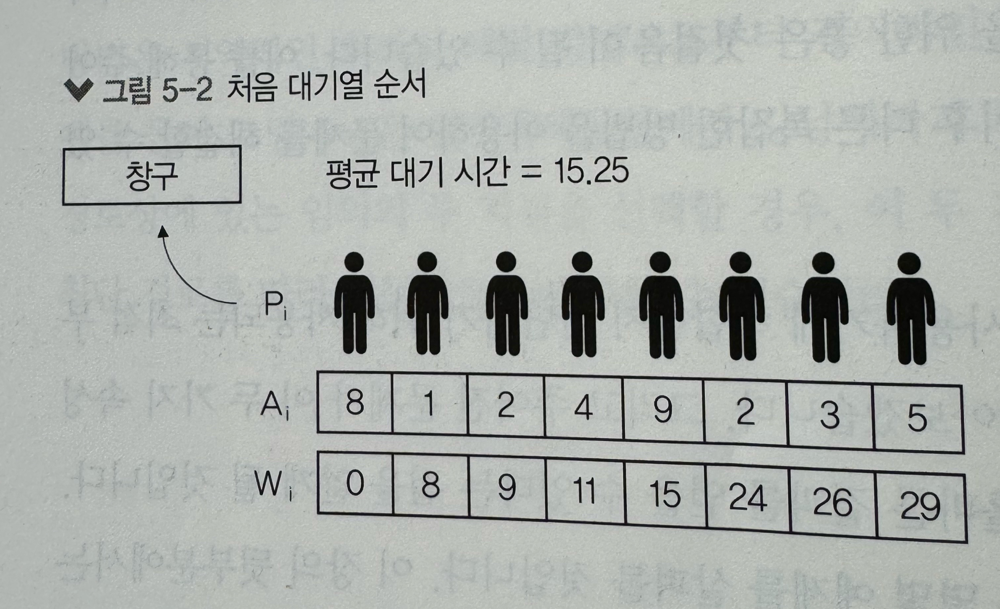
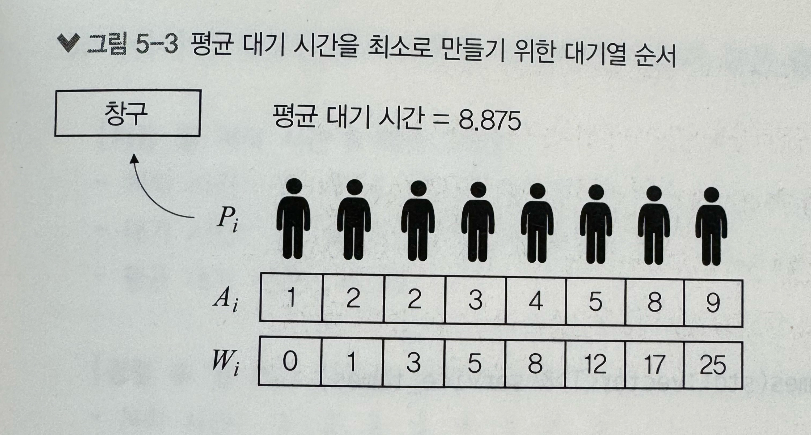
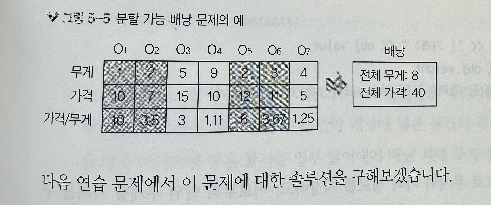
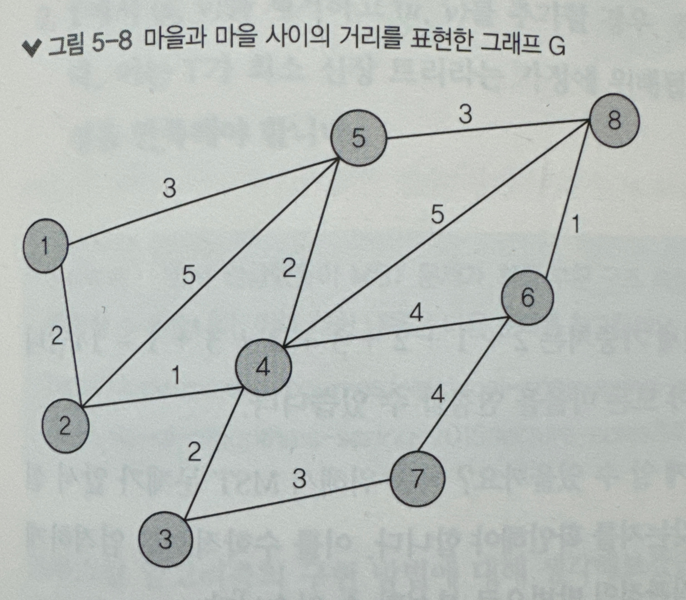
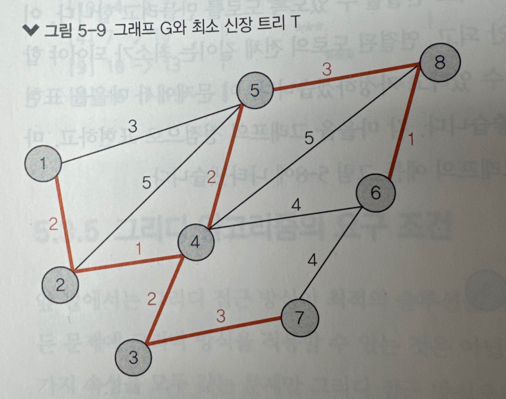
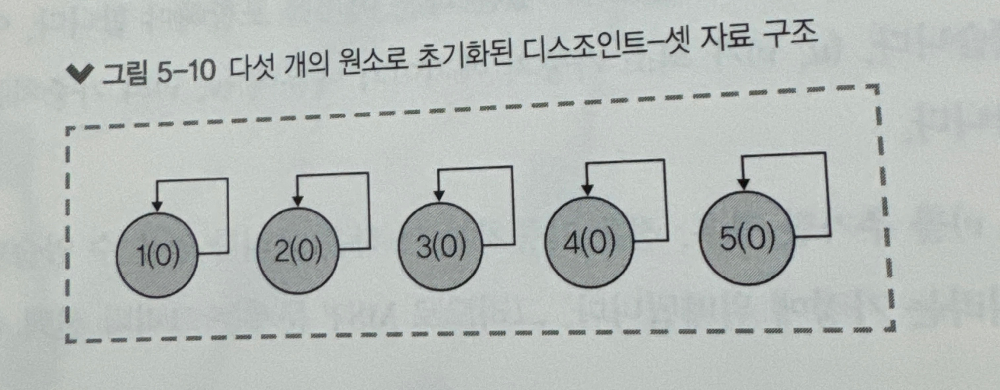
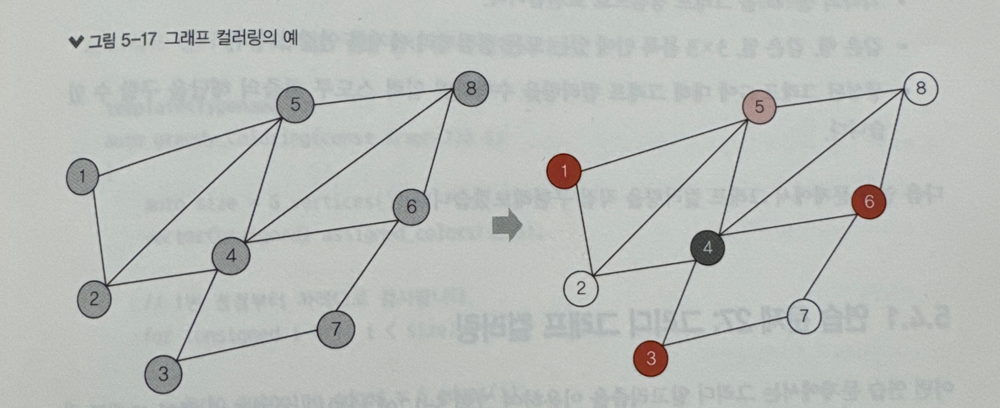

# 그리디 알고리즘
* 주어진 문제에서 최적 부분 구조와 그리디 선택 속성을 판별할 수 있다.
    * 최적 부분 구조와 그리디 선택 속성 : 그리디 방식을 사용하기에 적합한지 판단하기 위해 사용되는 것
    * 주어진 문제가 이 두가지 속성을 가지고 있을 경우, 그리디 방법에 의해 올바른 결과를 얻을 수 있다
* 그리디 알고리즘을 구현하여 분할 가능 배낭 문제와 그래프 컬러링 문제를 해결할 수 있다.
* 디스조인트-셋 자료 구조를 이용하여 크루스칼 최소 신장 트리 알고리즘을 구현할 수 있다.
* 그리디 알고리즘은  <span style="color: black; background-color: yellow;">**매 단계에서 '가장 좋아 보이는' 해답을 선택하는 알고리즘**</span>
* 즉, 지연적인 최적의 해결 방법으로부터 전역적인 최적의 해결 방법을 구성하는 방식
* 예를 들어, 인천국제공항에서 강남역까지 차로 이동하는 최단 경로 => 두 지점의 최단 이동 거리는 처음에 구한 전체 최단 경로를 따라 이동함으로써 구함
    * 전체 최단경로는 사실상 이 경로상에 존재하는 다수의 지점 사이를 최단 거리 경로로 모두 연결시켜 놓은 것
    * 즉, 출발 지점에서 아직 방문하지 않은 가장 가까운 지점까지의 경로를 찾고, 이를 목적 지점에 다다를 때까지 반복하는 것
    * 이 방법이 구글 지도 또는 빙 지도 같은 상용 소프트웨어에서 사용되는 다익스트라 최단 경로 알고리즘의 기본 개념

## 기본적인 그리디 알고리즘
* 그리디 방식으로 해결할 수 있는 대표적인 2문제
    * 최단 작업 우선 스케줄링
    * 분할 가능 배낭 문제
### 최단 작업 우선 스케줄링
* shortest_job_first.cpp
```
은행 창구에 줄을 서서 순서를 기다리는 사람이 있다. 
하나의 창구에서만 업무를 보고, N명의 사람이 기다리고 있다. 
이들 모두 일처리에 필요한 시간이 서로 다르다. 
평균 대기 시간이 최소화 될 수 있도록 어떻게 바꿔야할까?

=> 일 처리가 빨리 끝나는 대로 정렬해서 세운다.
``` 


## 배낭 문제
* 일반 배낭 문제는 NP-완전 문제로 알려져 있어서 다항 시간 솔류션을 사용할 수 없다. 그러나 0-1 배낭 문제를 조금 변경한 **분할 가능 배낭 문제(fractional knapsack problem)** 는 그리디 방식으로 해결할 수 있다.
### 0-1 배낭 문제
```
물건들의 집합 O = {O~1~, O~2~,...,O~n~}이 있고, 여기에 i번째 물건 O~i~의 무게는 W~i~이고 가격은 V~i~이다. 
그리고 최대 무게를 T까지 견딜 수 있는 가방(배낭)이 하나 주어짐. 
가방에 넣은 물건들의 가격 합이 최대가 되도록 물건을 선택하려고 한다.
단, 물건들의 무게 합이 T를 넘지 않아야 함.
```
* 배낭 문제는 NP-완전 문제로 알려져 있으며, 이 문제에 대한 다항 시간 솔루션은 알려져 있지 않다.=> **결과적으로 모든 가능한 조합을 조사하여 무게가 T를 넘지 않는 가장 높은 가격을 찾아내야 함.**
### 분할 가능 배낭 문제
* fractional_knapsack.cpp
* 위의 일반 배낭 문제를 조금 바꿔서 주어진 물건을 원하는 형태로 얼마든지 분할할 수 있고, 각 물건의 일부분만 배낭에 담을 수 있다고 가정.
* **일반 배낭 문제가 NP-완전인 것과 달리 분할 가능 배낭 문제는 간단한 솔루션이 존재함.**
    * 각 물건을 단위 무게당 가격을 기준으로 정렬하고, 그리디 방식에 따라 단위 무게당 가격이 높은 순서로 물건을 선택함.
* <span style="color: black; background-color: yellow;">분할 가능 배낭 문제는 물건의 일부만을 배낭에 담을 수 있다는 점이 0-1 배낭 문제와 다름</span>

### 그리디 알고리즘의 요구 조건
최적 부분 구조와 그리디 선택이라는 두가지 속성을 모두 갖는 문제만 그리디 접근 방식으로 최적의 솔루션을 구할 수 있다.
#### 최적 부분 구조(optimal substructure) 
* 주어진 문제 P에 대한 최적의 솔루션이 P의 부분 문제들의 최적의 솔루션으로 구성될 경우, 문제 P가 최적의 부분 구조를 갖는다고 말함.
#### 그리디 선택(greedy choice)
* 주어진 문제 P에 대한 지역적 최적 솔루션을 반복적으로 선택하여 전체 최적 솔루션을 구할 수 있을 경우, 문제 P가 그리디 선택 속성을 갖는다고 말함.

최적 부분 구조와 그리디 선택 속성에 대해 이해하기 위해 => 크루스칼 최소 신장 트리 알고리즘 알아보자!
### 최소 신장 트리 문제
* kruskal_mst.cpp
* MST, Minimum Spanning Tree
```
정점의 집합 V와 가중치를 갖는 에지의 집합 E로 구성된 그래프 G = <V,E>가 주어질 때, 모든 정점을 연결하고 연결된 에지의 가중치 합이 최소인 트리 T를 구하시오.
```
* 실생할에서 찾아볼 수 있는 MST 문제 예 : 상수도관 네트워크, 도로 네트워크 설계
* 예시 문제
    ```
    지도상에 여덟 개의 마을이 있고, 모든 마을이 서로 연결될 수 있도록 도로를 만들려고 한다.
    이때 연결된 도로는 사이클을 구성하면 안되고, 연결된 도로의 전체 길이는 최소가 되어야 한다.
    모든 도로는 양방향으로 상호 이동할 수 있다고 가정.

    => 각 마을을 그래프의 정점으로 표현, 마을 사이의 거리를 에지의 가중치로 표현
    ```
    
#### 최소 신장 트리 T를 구하는 알고리즘
1. 그래프 G의 모든 에지를 최소 힙 H에 추가한다.
2. H로부터 에지 e를 하나 꺼낸다. 당연히 e는 모든 에지 중에서 가장 가중치가 작은 에지이다.
3. e의 양 끝 정점이 이미 T에 있을 경우, e로 인해 T에서 사이클이 발생할 수 있다. 그러므로 이런 경우에는 e를 버리고 2단계로 이동
4. 최소 신장 트리 T에 e를 추가하고, 2단계로 이동한다.

* 2~ 4단계까지 반복하면서 가장 작은 가중치의 에지를 찾고, 이 에지에 의해 사이클이 발생하지 않으면 해당 에지와 양 끝 정점을 최종 솔루션에 추가한다.
* 이 알고리즘은 매 반복마다 최소 에지 가중치를 선택하기 때문에 그리디 방식이라고 할 수 있다.
* 이 알고리즘은 1956년에 발표되었으며 <span style="color: black; background-color: yellow;"> **크루스칼 최소 신장 트리 알고리즘**</span>이라고 부름.
 
**위에서 3단계 다소 복잡함. 그래프 에지 정보를 저장할 자료 구조가  필요하고, 새로운 에지를 추가할 때 사이클이 발생하는지를 판단하는 기능이 필요함. => 디스조인트-셋 자료 구조 사용하여 해결**
### 디스조인트-셋 자료구조
* 디스조인트-셋 또는 유니온-파인드 자료 구조는 트리 형태의 원소로 구성된 포레스트이다.
* 각각의 원소는 숫자 ID에 의해 표현되며, 랭크(rank)와 부모에 대한 포인터를 가짐.
* 디스조인트-셋 자료 구조가 초기화되면 랭크가 0인 N개의 독립적인 원소가 생성되며, 각각의 원소는 하나의 트리를 나타냄
* * 다음 연산을 지원한다.
    * make-set(x) : x를 ID로 갖는 원소를 디스조인트-셋 자료 구조에 추가함.
        * 새로 추가한 원소의 랭크 0
        * 부모 포인터는 자기 자신을 가리키도록 설정
        * 아래 이미지는 다섯 개의 원소로 초기화된 디스조인트-셋 자료구조의 예
            * 원 안의 숫자는 Id, 괄호 안의 숫자는 랭크, 부모 포인터는 화살표
            
    * find(x)  : 원소 x에서 시작해서 부모 포인터를 따라 반복적으로 이동하여 트리의 루트를 반환함.
        * 루트 원소의 부모는 루트 자신임
    * union(x, y) 
        * x와 y의 루트를 먼저 찾고, 만약 루트가 같다면 x와 y가 같은 트리에 속함을 의미하며 아무런 작업도 안일어남.
        * 루트가 다르다면 높은 랭크 루트를 낮은 랭크 루트의 부모로 설정
#### 디스조인트-셋 자료 구조를 사용하여 크루스칼 최소 신장 트리 알고리즘 구현하는 방법
* 그래프의 정점 개수가 N이라면, 먼저 N개의 원소를 갖는 디스조인트-셋 자료 구조를 초기화한다.
* 앞서 설명한 크루스칼 알고리즘 2단계와 3단계에서 최소 힙을 이용하여 가장 가중치가 작은 에지를 선택하고, 사이클 발생 여부를 검사한다고 했음 => **사이클 발생 여부 판단을 위해 union(x, y) 연산 활용**
    * 즉, 에지 양 끝의 두 정점에 대해 union(x, y) 연산을 수행하여 실제로 두 트리가 병합하면 해당 에지를 MST에 추가한다.
    * 만약 x와 y의 루트가 같으면 두 정점을 잇는 에지에 의해 사이클이 발생한다는 의미 => MST에 추가하지 않음
## 그래프 컬러링
* graph_coloring.cpp
```
주어진 그래프 G에서 서로 인접한 정점끼리 같은 색을 가지지 않도록 모든 정점에 색상을 지정해야 한다.
```

* 실생활 사용 예 : 택시 예약 스케줄 작성, 스도쿠 퍼즐 풀기, 시험 시간표 작성 등
* 그래프 컬러링에 필요한 최소 개수의 색상 수를 찾는 것은 NP-완전 문제로 알려져 있다. 다만 문제를 조금 변경함으로써 시간 복잡도를 크게 변경할 수 있다.
    * 그래프 컬러링의 평가는 얼마나 적은 수의 색상을 사용했는가에 의해 결정됨.
    * 가능한 적은 수의 색상을 최적의 그래프 컬러링 찾기는 NP-완전한 문제이지만, 그리디 방식이 유용한 근사치를 제공하곤 함.
    * 컴파일러를 설계할 경우, 컴파일 하는 프로그램의 변수에 CPU 레지스터를 할당하기 위해 그래프 컬러링이 사용됨.
* 그래프 컬러링 문제의 응용 중 스토쿠 퍼즐을 그래프 컬러링 문제로 해결 
    * 각각의 셀을 그래프 정점으로 표현.
    * 같은 행, 같은 열, 3*3 블록 안에 있는 모든 정점끼리 에지를 연결
    * 생성된 그래프 G에 대해 그래프 컬러링을 수행하면 입력 스도쿠 퍼즐의 해답을 구할 수 있음
### 웰시-포웰 알고리즘
* welsh_powell_solution.cpp
* 차수(정점에 연결된 에지의 개수)가 높은 정점부터 차례대로 그래프 컬러링을 수행하는 것
1. 모든 정점을 차수에 대한 내림차순으로 정렬하고 배열에 저장한다.
2. 정렬된 배열에서 색상이 지정되지 않은 첫 번째 정점을 선택하고, 이 정점과 연결된 모든 정점을 조사하여 아직 사용되지 않은 색상을 해당 정점에 지정한다. 이 색상을 C라고 지칭
2. 정렬된 배열에서 색상이 지정되지 않은 정점을 모두 찾고, 만약 이 정점의 이웃이 C 색상을 가지고 있지 않다면 해당 정점에 C 색상을 지정.
2. 배열에 색상이 지정되지 않은 정점이 남아 있다면 2단계로 이동, 남아 있는 정점이 없다면 종료한다. 이때까지 정점에 지정된 색상이 최종 결과임.