# 그래프 알고리즘
* 그래프에서 틀정 원소를 찾기 위해 적절한 탐색 방법을 선택하여 구현
* 프림 알고리즘을 이용하여 최소 신장 트리를 구할 수 있다.
* 프림 알고리즘과 크루스칼 알고리즘 중에서 주어진 상황에 적합한 알고리즘을 선택할 수 있다.
* 다익스트라 알고리즘을 이용하여 두 정점 사이의 최단 경로를 찾을 수 있다.
## 그래프 순회 문제
* 특정 정점에서 시작하여 나머지 모든 정점을 방문하는 문제를 그래프 순회 문제라고 함.
* 그래프 순회 문제는 그래프에서 특정 정점을 찾기 위한 용도로 사용될 수 있기 때문에 **그래프 탐색 문제**라고도 부름.
### 너비 우선 탐색(BFS, Breadth-First Search)
* bfs.cpp
* 시작 정점을 경계(frontier)에 추가하는 것으로 시작한다.
* 경계는 이전에 방문했던 정점들에 의해 구성됨. 
* 그리고 현재 경계에 인접한 정점을 반본적으로 탐색
* 시간 복잡도는 O(V + E), V는 정점의 개수, E는 에지의 개수를 의미
#### BFS의 동작
1. 먼저 시작점인 '우리집'정점을 방문
    * 아래 이미지에서 빨간색 점선이 현재 경계를 나타냄
    * 인접한 정점 : R1, R2
    <div>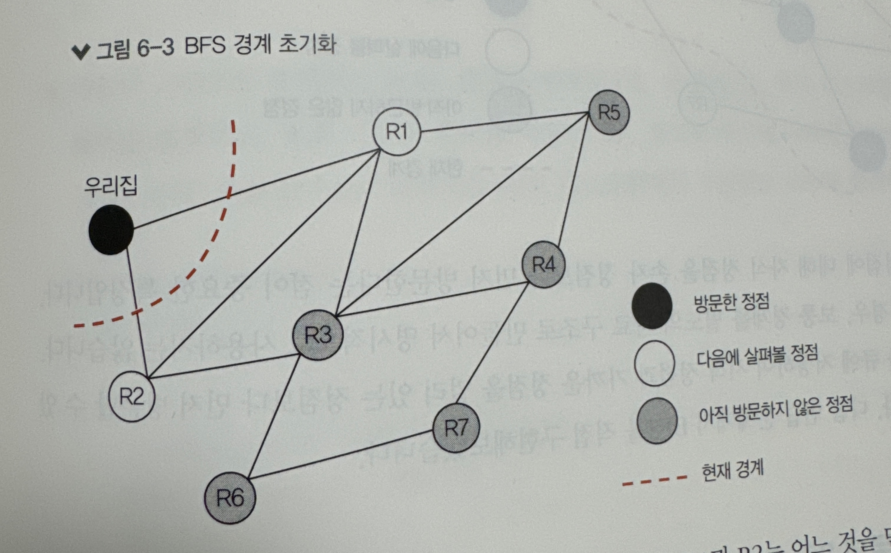</div>
2. 아래 이미지는 R1, R2를 방문한 후의 BFS 상태. 둘 중 어느것을 먼저 방문해도 상관없다.
    * 시작 정점과 같은 거리에 있는 정점들의 방문 순서는 임의로 지정해도 됨.
    <div>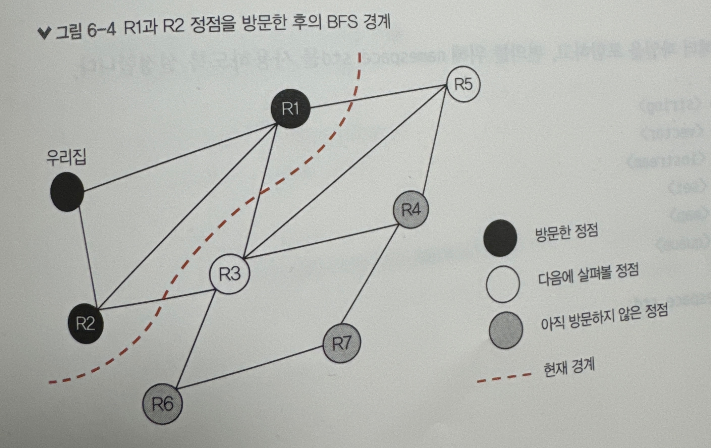</div>
3. 아래 이미지는 R3, R5, R4, R6를 방문한 후의 BFS 상태이며, 전체 그래프를 순회하기 직전의 모습
     <div>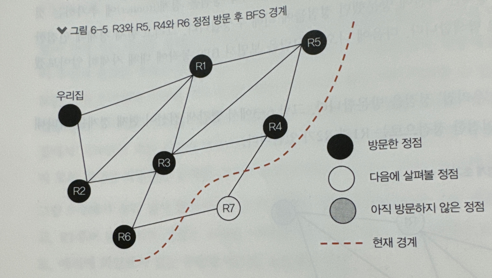</div>
* BFS는 모든 정점에 대해 자식 정점을 손자 정점보다 먼저 방문한다는 점이 중요한 특징.
* BFS를 구현할 경우, 보통 경계를 별도의 자료 구조로 만들어서 명시적으로 사용하지는 않는다. 대신 <span style="background-color:yellow;color:black;">정점ID를 **큐**에 저장하여 시작 정점과 가까운 정점을 멀리 잇는 정점보다 먼저 방문할 수 있도록 구현</span>

### 깊이 우선 탐색(DFS, Depth-First Search)
* dfs.cpp
* 시작 정점에서 시작하여 특정 경로를 따라 가능한 멀리 있는 정점을 재귀적으로 먼저 방문하는 방식
* 그리고 더 방문할 정점이 없어지면 다른 경로를 찾아 다시 멀어지는 방향으로 탐색을 반복한다.
* 이러한 그래프 탐색 방법을 **백트래킹**이라고 함.
* 시간 복잡도는 O(V + E), V는 정점의 개수, E는 에지의 개수를 의미
#### DFS의 동작
1. 가장 먼저 '우리집'정점부터 방문
    <div>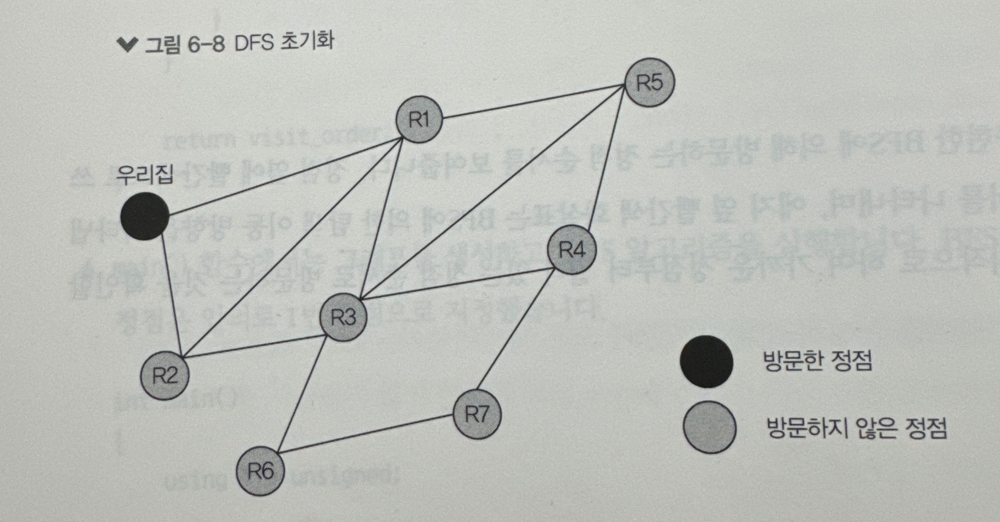</div>
2. 다음으로 R2 정점을 방문한다. 여기서는 우리집 정점과 연결된 정점 R1과 R2 중에서 R2를 임의로 선택.
    * R1과 R2 중에서 어느 것을 먼저 방문해도 DFS알고리즘으로 모든 정점을 탐색할 수 있다.
    <div>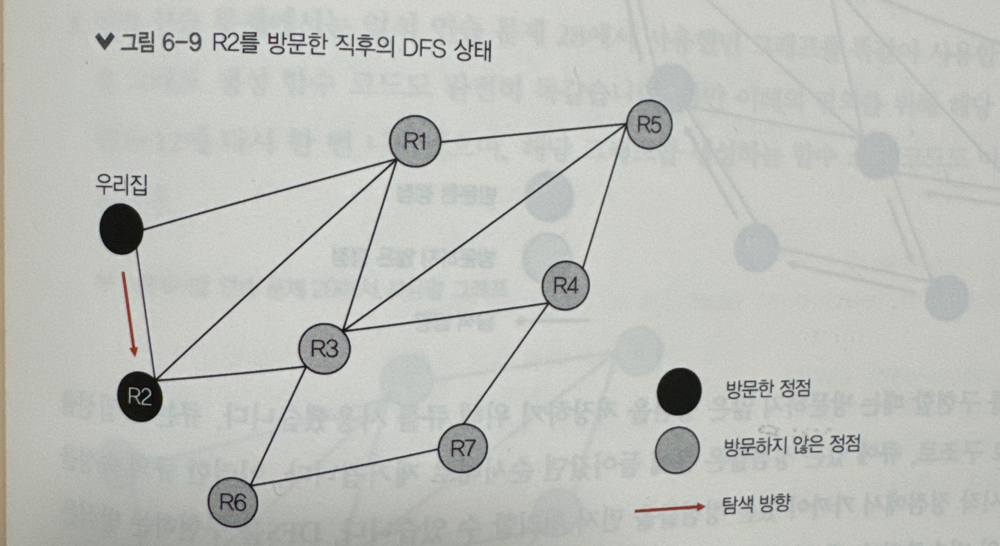</div>
3. 이번에는 R3 정점을 방문한다. R2와 연결된 정점은 R1과 R3이며, 이 중 임의로 R3를 먼저 선택한다.
    <div>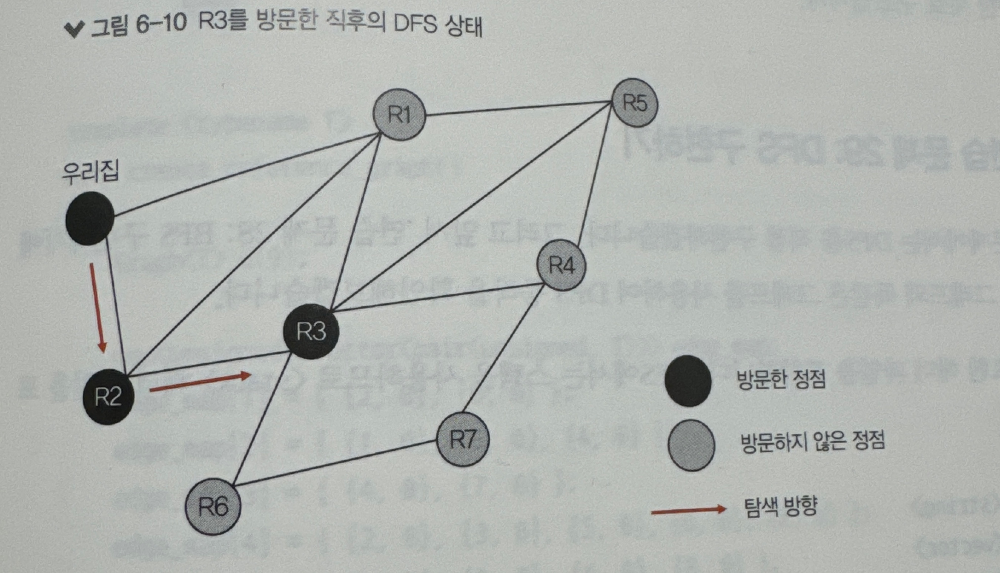</div>
4. 아래 이미지는 인접한 정점 중에서 아직 방문하지 않은 정점을 찾아 탐색을 계속 진행하는 과정이다. 마지막으로 R1을 방문하면 이제 방문하지 않은 정점을 찾을 수 없게 됨. 이런 경우 탐색 종료
    <div>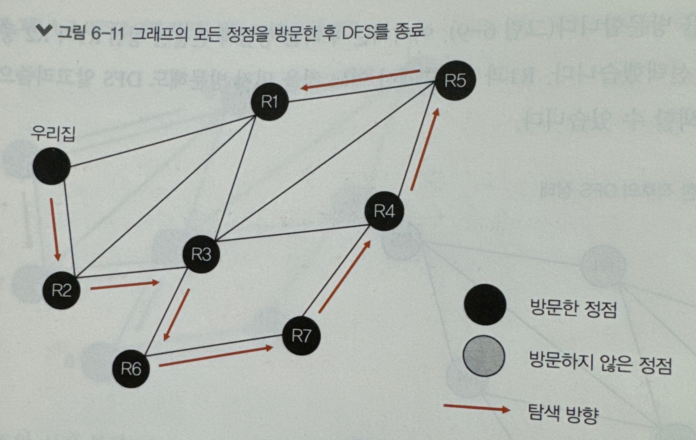</div>
* DFS를 구현하는 방식은 <span style="background-color:yellow; color:black;">**스택**을 사용한다.</span>후입선출 속성으로 현재 정점과 인접한 정점들을 재귀적으로 이동하면 방문할 때 사용하기에 적합한 자료구조
### BFS와 DFS의 차이점과 적합한 사용 시나리오
* BFS는 시작 정점에서 가장 가까운 정점을 찾는데 적합. DFS는 대체로 시작 정점에서 멀리 있는 정점을 찾을 때 적합
* BFS는 특정 정점을 방문할 경우, 시작 정점에서 해당 정점까지의 최단 거리 경로가 보장. 그러나 DFs에서는 최단 경로를 보장하지 않음. 이러한 속성 때문에 **단일-시작 또는 다중-시작 최단 경로 알고리즘이 BFS 알고리즘을 조금 변경하여 사용**하고 있다.
* BFS는 현재 경계에서 인접한 모든 정점을 방문하므로 BFS에 의해 생성된 검색 트리는 짧고 넓은 편이며 많은 메모리를 필요로 함. DFS에 생성된 검색 트리는 길고 좁은 편이며, 상대적으로 적은 메모리를 필요로 함.
### 이분 그래프(bipartite graph)  판별하기
* bipartite_check.cpp
```
정점을 두 개의 집합으로 나눌 수 있는 그래프이며, 이때 그래프의 모든 에지는 서로 다른 집합에 속한 정점끼리 연결되어야 함.
```
* 예를 들어, 학생 목록과 수업 목록이 있을 때, 학생들이 어떤 수업을 수강하고 있는 지를 이분 그래프로 표현
    * 아래와 같은 모델이 주어질 경우, 특정 학생이 신청한 두 개의 수업이 같은  시간대에 중복되지 않도록 수강 계획을 만드는 데 사용할 수 있음. 
    * 예를 들어, 유미가 수학과 영어 과목을 수강했다면, 두 수업은 같은 시간대에 진행되면 안됨.
    * 수업 시간표 작성 시 이러한 충돌을 최소화 하는 작업은 그래프에서 최대 유량 문제(maximum flow problem)를 풀어 달성할 수 있다.
        * 최대 유량 문제에 대해서 몇 가지 표준 알고리즘 : 포드-폴커슨 알고리즘, 디닉 알고리즘, 푸시-리레이블 알고리즘
    <div>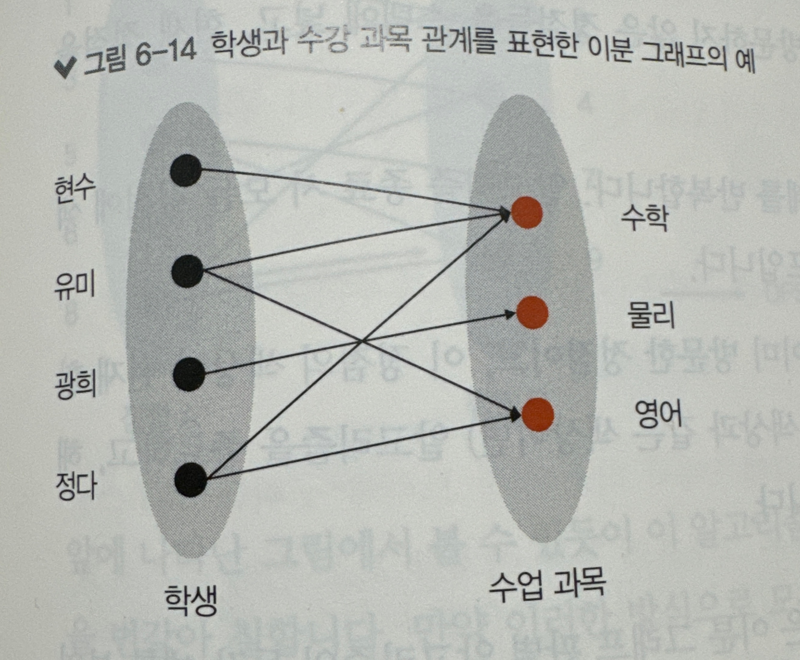</div>
* 넷플릭스나 유튜브 같은 대형 비디오 스트리밍 플랫폼에서 제공되는 영화 목록과 시청자 사이의 관계도 이분 그래프를 사용하여 모델링 할 수 있음.
* 이분 그래프에 대해 흥미로운 사실은 최대 매칭(maximum matching) 또는 최소 정점 커버(minimum vertex cover) 문제처럼 일반 그래프에서는 NP-완전인 문제들이 이분 그래프에서는 다항 시간으로 풀 수 있다는 점, 따라서 **주어진 그래프가 이분 그래프인지 아닌지를 알아내는 것은 매우 중요함**
#### 이분 그래프를 반펼하는 알고리즘은 DFS를 조금 변형하여 만들 수 있다.
1. 1번 정범부터 DFS를 시작한다고 가정. 그러므로 1번 정점을 스택에 추가
2. 만약 스택에 방문하지 않은 정점이 남아 있으면 스택에서 정점을 하나 꺼내고 이를 현재 정점으로 설정
3. 이전 정점에 할당된 색상이 '검은색'이면, 현재 정점에 '빨간색'을 할당한다. 반대로 이전 정점에 할당된 색상이 '빨간색'이면, 현재 정점에 '검은색'을 할당.
4. 현재 정점과 인접한 정점들 중에서 아직 방문하지 않은 정점들을 스택에 넣고, 현재 정점을 방문한 것으로 설정.
5. 모든 정점에 색상이 지정될 때까지 2~4단계를 반복한다. 알고리즘 종료 시 모든 정점에 색상이 칠해져 있다면 이 그래프는 이분 그래프이다.
6. 만약 탐색을 진행하다가 만나게 된 정점이 이미 방문한 정점이고, 이 정점의 색상이 현재 할당할 색상과 다른 색상이면(즉, 이전에 칠한 색상과 같은 색상이면) 알고리즘을 종료하고, 해당 그래프가 이분 그래프가 아니라고 판별.
## 프림의 최소 신장 트리 알고리즘
* prim.cpp
```
정점 집합 V와 가중치를 갖는 에지 집합 E로 구성된 그래프 G = <V,E>가 주어질 때, 모든 정점을 연결하고 연결된 에지의 가중치 합이 최소인 트리 T를 구하시오.
```
* 크루스칼 알고리즘은 그래프의 모든 에지를 최소 힙에 추가하고, 사이클을 만들지 않는 최소 가중치의 에지를 이용하여 MST를 구성함.
* <span style="background-color:yellow; color:black;">프림 알고리즘(Prim's algorithm)은 BFS의 동작 방식과 유사하다.</span>
    * 프림 알고리즘은 자빅 알고리즘(Jarvik's algorithm)으로도 알려져 있음.
* 먼저 시작 정점을 이용하여 경계를 구성한다.(경계는 이전에 방문했던 정점들에 의해 구성) 현재 경계에 인접한 정점을 반복적으로 탐색함. 이때 경계를 관통하는 에지 중에서 가장 가중치가 작은 에지를 선택하고, 이 에지에 연결된 정점을 방문함.
* 프림 알고리즘을 구현하려면 그래프의 각 정점에 경계로부터의 거리 정보를 기록해야 한다.
### 프림 알고리즘 동작 순서
1. 모든 정점의 거리 값을 무한대로 초기화한다. 그리고 모든 거리 값을 최소 힙 H에 추가.
    * 시작 정점에서 자기 자신까지의 거리는 0이므로 시작 정점의 거리 값은 0으로 설정.
    * 정점 안의 숫자는 정점 ID, 빨간색은 경계에서 해당 정점까지의 거리, 에지 옆 검은색 숫자는 가중치
     <div>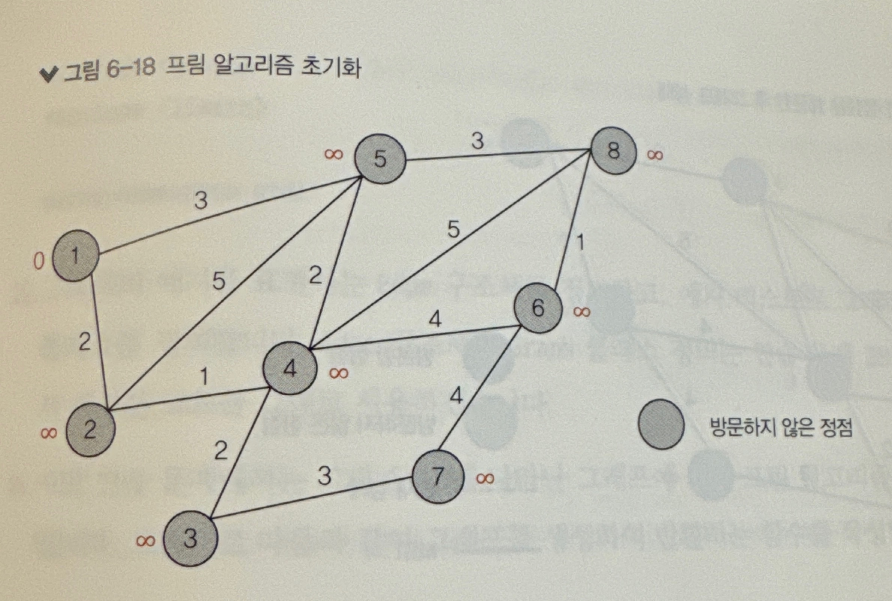</div>
2. **최소 힙 H로부터 정점을 하나 꺼낸다. 이 정점을 U라고 하면, 정점 U는 경계에서 가장 가까이 있는 정점이다. 이 정점을 MST에 추가하고, 이 정점을 포함하도록 경계를 새로 설정한다.**
3. U와 인접한 모든 정점 V에 대해, 만약 V의 거리 값이 (U, V)의 에지 가중치보다 크면 V의 거리 값을 (U, V)의 에지 가중치로 설정한다. 
    * 아래 이미지에서 1번 정점과 연결된 2,5번 정점의 거리 값이 각각 2,3으로 변경된 것을 볼 수 있다. 이러한 과정을 정점 U에 안착(settle)했다고 함.
    <div>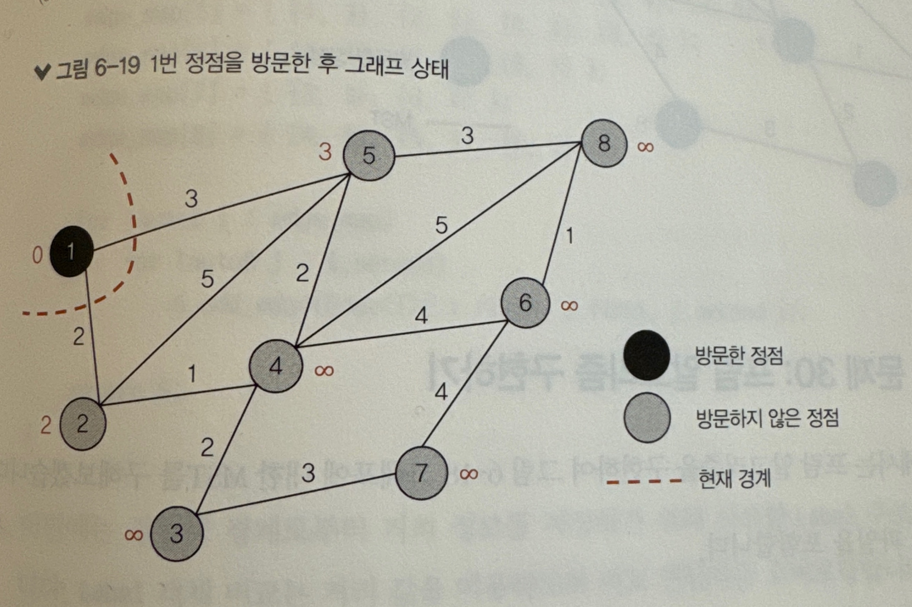</div>
4. 방문하지 않은 정점이 남아 있다면 2단계로 이동. 아래 이미지는 2번 정점을 방문한 후의 그래프 상태이다. 이 그림에서 빨간색 에지는 현재까지 구성된 MST를 나타냄
        <div>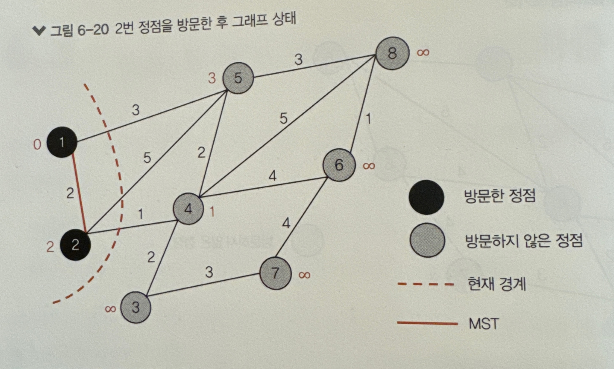</div>
5. 모든 정점에 대해 안착한 후, 아래 이미지와 같은 MST가 생성됨
        <div>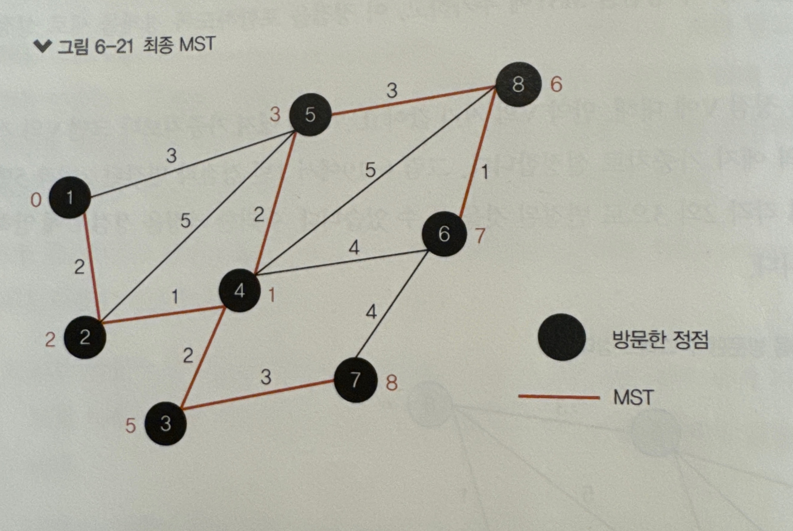</div>
* 이진 최소 힙과 MST 저장을 위해 인접 리스트를 사용하여 구현한 프림 알고리즘의 시간 복잡도는 O(E log V). 만약 '피보나치 최소힙'이라고 부르는 힙 구조를 사용할 경우 시간 복잡도는 O(E + V log V)로 향상됨.
    * **피보나치 힙(Fibonacci heap)은 우선순위 큐(priority queue) 연산을 위한 자료 구조**로, 힙-정렬된 트리를 모아놓은 자료 구조
### 크루스칼 알고리즘과 프림 알고리즘 비교
* 프림 알고리즘과 크루스칼 알고리즘은 모두 그리디 알고리즘의 일종이지만, 차이점을 가지고 있음

<table>
    <tr>
        <th>크루스칼 알고리즘</th>
        <th>프림 알고리즘</th>
    </tr>
    <tr>
        <td><span style="background-color:yellow; color:black;">그래프의 최소 가중치 에지를 차례대로 추가하여 MST를 구성</span> (크루스칼은 그래프 G의 모든 에지를 최소 힙 H에 추가하는 것 부터 시작함. H로부터 에지 e를 하나 꺼낸다. 당연히 e는 모든 에지 중에서 가장 가중치가 작은 에지이다.)</td>
        <td><span style="background-color:yellow; color:black;">그래프의 아무 정점부터 시작하여 MST를 구성한다.</span></td>
    </tr>
        <td>가장 널리 알려진 시간 복잡도는 O(E log V)이다.</td>
        <td>가장 널리 알려진 시간 복잡도는 O(E + V log V)이다.</td>
    <tr>
    </tr>
    <tr>
        <td>주로 적은 수의 에지로 구성된 희소 그래프(sparse graph)에서 사용됨.</td>
        <td>주로 많은 수의 에지로 구성된 밀집 그래프(dense graph)에서 사용됨.</td>
    </tr>
<table>

## 다익스트라 최단 경로 알고리즘
* dijkstra.cpp
* 그래프에서 단일 시작(single source) 최단 경로 문제(shortest path problem)는 구글 지도 또는 자동차 네비게이션 등에서 경로를 탐색할 때 사용된다. 이 문제는 다음과 같이 정의됨.
    ```
    주어진 그래프 G = <v, E>가 있다. 여기서 V는 정점의 집합이고, E는 에지의 집합이다. 각각의 에지는 가중치를 가지고 있다. 시작 정점(source vertex)과 목적 정점(destination vertex)이 주어질 때, 시작 정점에서 목적 정점까지 이어지는 최소 비용 경로를 구하시오.
    ```
* 다익스트라 알고리즘(Dijkstra's algorithm)은 <span style="background-color: yellow; color: black;">음수 가중치가 없는 그래프에서 동작하는 최단 경로 탐색 알고리즘으로 프림의 MST 알고리즘을 약간 변경한 형태</span>
### 다익스트라 알고리즘이 프림 알고리즘과 다른 차이점
* 프림 알고리즘은 경계로부터 최소 거리를 정점의 거리 값으로 설정하지만, 다익스트라 알고리즘은 시작 정점으로부터 각 정점까지의 전체 거리를 사용함.
* 다익스트라 알고리즘은 목적 정점이 나타나면 종료하지만 프림 알고리즘은 모든 정점을 방문해야 종료함.
### 다익스트라 알고리즘의 동작
1. 모든 정점의 거리 값을 무한대로 초기화한다. 시작 정점에서 자기 자신까지의 거리는 0이므로 시작 정점의 거리 값은 0으로 설정한다. 그리고 모든 거리 값을 최소 힙 H에 추가한다.
    * 정점 안의 숫자는 정점 ID
    * 정점 옆에 있는 빨간색 숫자는 현재까지 알려진 시작 정점(1번 정점)에서 각 정점까지의 최소 거리. 이 값은 무한대로 초기화되고, 시작 정점만 0으로 설정
     <div>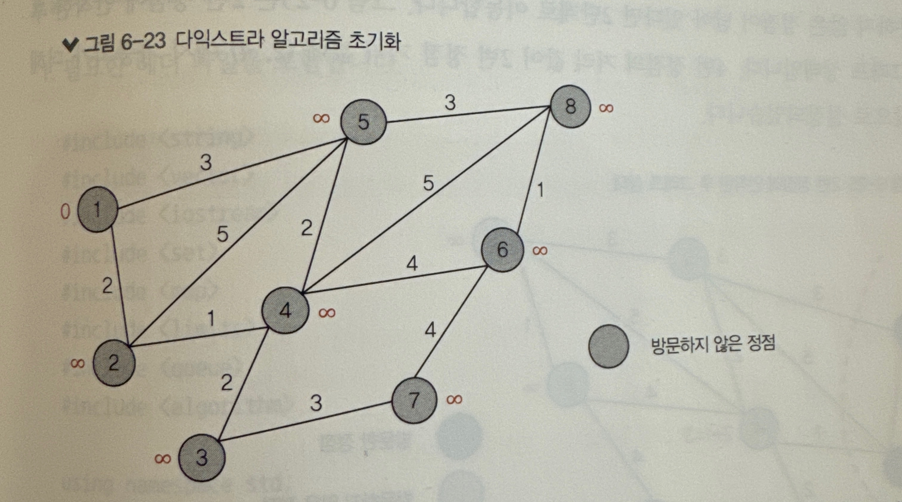</div>
2. **최소 힙 H로부터 정점을 하나 꺼낸다. 이 정점을 U라고 하면, 정점 U는 시작 정점에서 가장 가까운 정점임. 만약 U가 목적 정점이면 최단 경로를 찾은 것이므로 알고리즘을 종료한다.**
3. U와 인접한 모든 정점 V에 대해, 만약 V의 거리 값이 (U의 거리값 + (U,V) 에지 가중치)보다 크면 V까지 다다르는 더 짧은 경로를 찾은 것으로 볼 수 있다. 그러므로 V의 거리 값을 (U의 거리 값 + (U + V) 에지 가중치)값으로 설정함. 이러한 과정을 정점 U에 안착했다고 한다.
     <div>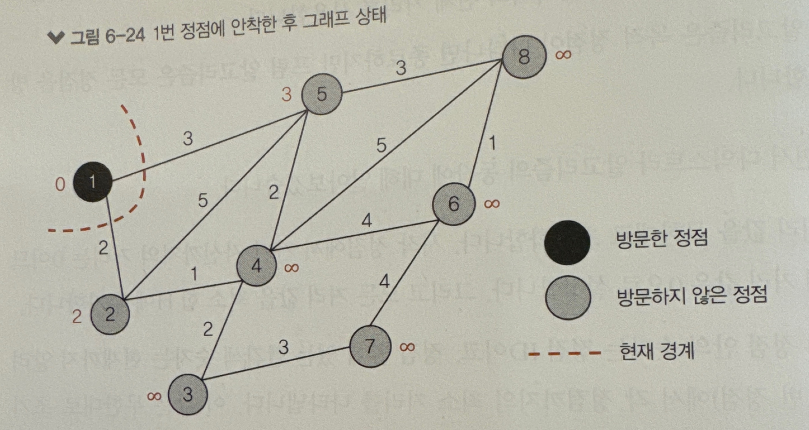</div>
4. 방문하지 않은 정점이 남아 있다면 2단계로 이동한다. 아래 이미지는 2번 정점에 안착한 후의 그래프 상태이다. 4번 정점의 거리 값이 2번 정점 거리 값에 (2, 4) 에지 가중치에 더해진 값으로 설정되었음.
     <div>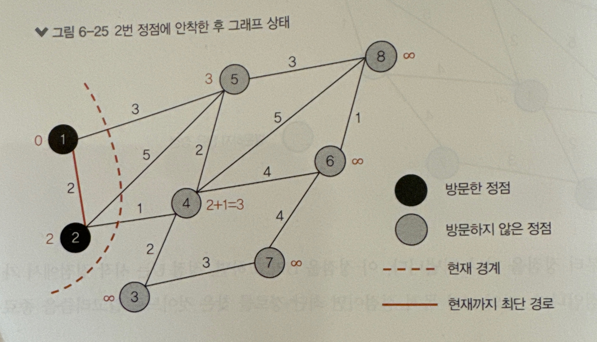</div>
5. 최소 힙 H로부터 꺼낸 정점이 목적 정점(6번 정점)이면 알고리즘을 종료한다. 
    * 1번 정점에서 6번 정점까지의 최단 경로를 아래 이미지의 빨간색 실선으로 나타냄.
    *  이 그림에서 각 정점에 나타난 거리 값은 시작 정점에서 해당 정점까지의 최소 거리를 나타냄.
     <div>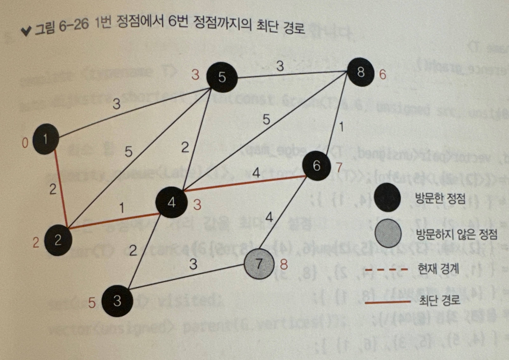</div>