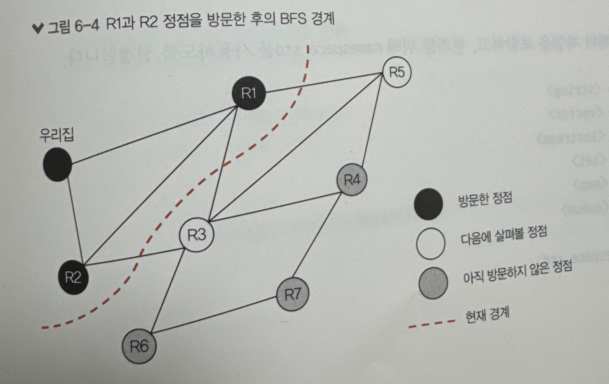
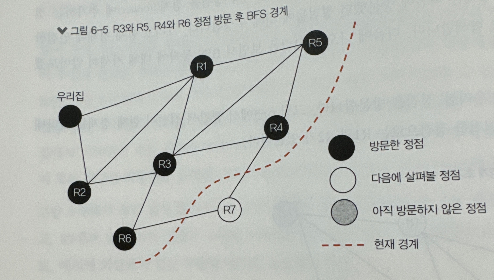

# 그래프 알고리즘
* 그래프에서 틀정 원소를 찾기 위해 적절한 탐색 방법을 선택하여 구현
* 프림 알고리즘을 이용하여 최소 신장 트리를 구할 수 있다.
* 프림 알고리즘과 크루스칼 알고리즘 중에서 주어진 상황에 적합한 알고리즘을 선택할 수 있다.
* 다익스트라 알고리즘을 이용하여 두 정점 사이의 최단 경로를 찾을 수 있다.
## 그래프 순회 문제
* 특정 정점에서 시작하여 나머지 모든 정점을 방문하는 문제를 그래프 순회 문제라고 함.
* 그래프 순회 문제는 그래프에서 특정 정점을 찾기 위한 용도로 사용될 수 있기 때문에 **그래프 탐색 문제**라고도 부름.
### 너비 우선 탐색(BFS, Breadth-First Search)
* bfs.cpp
* 시작 정점을 경계(frontier)에 추가하는 것으로 시작한다.
* 경계는 이전에 방문했던 정점들에 의해 구성됨. 
* 그리고 현재 경계에 인접한 정점을 반본적으로 탐색
#### BFS의 동작
1. 먼저 시작점인 '우리집'정점을 방문
    * 아래 이미지에서 빨간색 점선이 현재 경계를 나타냄
    * 인접한 정점 : R1, R2
    
2. 아래 이미지는 R1, R2를 방문한 후의 BFS 상태. 둘 중 어느것을 먼저 방문해도 상관없다.
    * 시작 정점과 같은 거리에 있는 정점들의 방문 순서는 임의로 지정해도 됨.
    
3. 아래 이미지는 R3, R5, R4, R6를 방문한 후의 BFS 상태이며, 전체 그래프를 순회하기 직전의 모습
    
* BFS는 모든 정점에 대해 자식 정점을 손자 정점보다 먼저 방문한다는 점이 중요한 특징.
* BFS를 구현할 경우, 보통 경계를 별도의 자료 구조로 만들어서 명시적으로 사용하지는 않는다. 대신 정점ID를 **큐**에 저장하여 시작 정점과 가까운 정점을 멀리 잇는 정점보다 먼저 방문할 수 있도록 구현