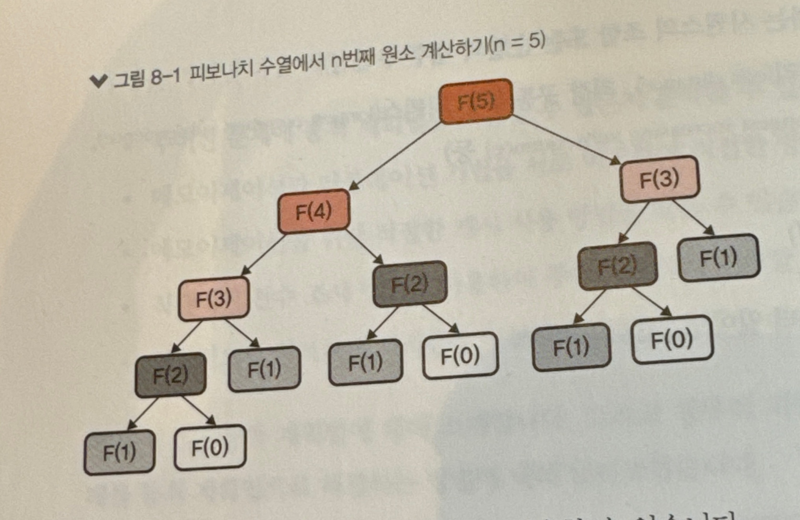
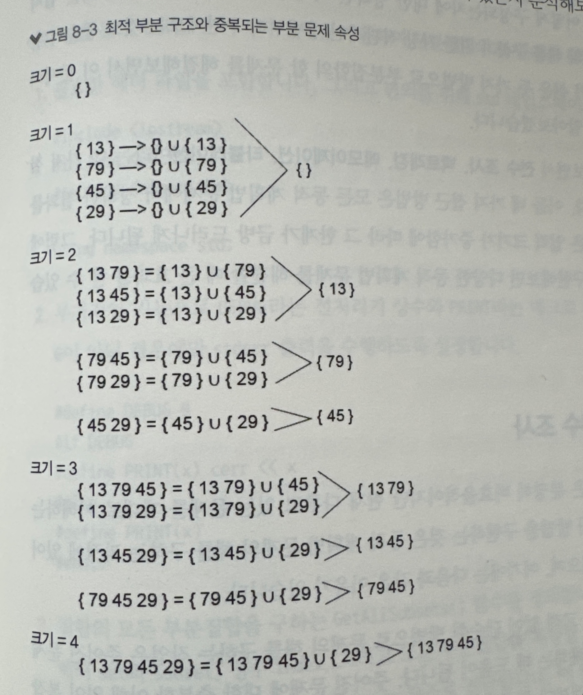
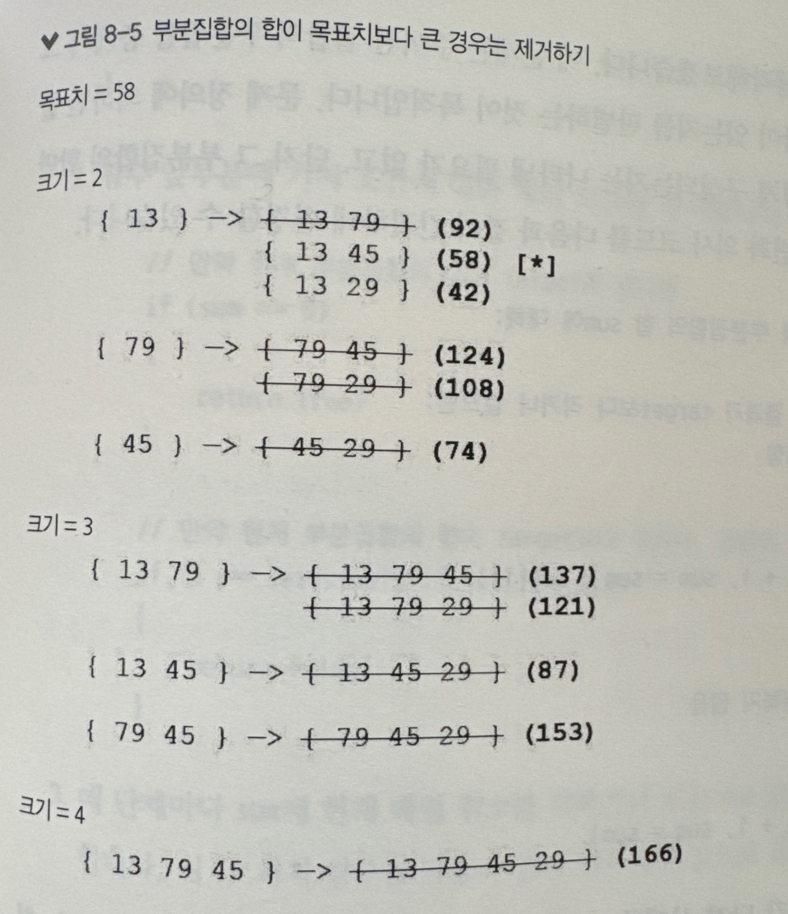

# 동적 계획법
* 주어진 문제에 동적 계획법을 적용할 수 있는지 분석할 수 있다.
* 메모제이션과 타뷸레이션 기법을 서로 비교하여 적절한 방법을 선택할 수 있다.
* 메모이제이션을 위한 적절한 캐시 사용 방법을 찾을 수 있다.
* 동적 계획법은 분할 정복 패러타임 개념을 확장한 것으로, 특정 분류의 문제에 사용됨.
* **동적 계획법이 자주 사용되는 몇 가지 예**
    * 조합(특정 기준을 만족하는 시퀀스의 조합 또는 순열의 개수 구하기)
    * 문자열과 시퀀스(편집 거리, 최장 공통 부분 시퀀스, 최장 증가 부분 시퀀스 등)
    * 그래프(최단 경로 문제)
    * 머신 러닝(음성/얼굴 인식)
## 동적 계획법이란?
* 피보나치 수열 {0, 1, 1, 2, 3, 5 ,...}을 수식으로 표현
    * 수식을 보면 재귀적인 관계를 가짐을 알 수 있음.
    * **기저 조건** : F(0), F(1) 더이상 재귀가 없어도 해를 구할 수 있는 지점을 나타냄
    ```
    F(0) = 0
    F(1) = 1
    ...
    F(n) = F(n-1) + F(n-2)
    ```
    <div></div>

    * 위와 같은 방식을 하향식 해법이라고 부름.
    * c++ 재귀함수로 구현
        ```c++
        int Fibonacci(int n) {
            if (n < 2)
                return n;
            return Fibonacci(n - 1) + Fibonacci(n - 2);
        }
        ```
* **분할 정복과 동적 계획법을 구분하는 특성**
    1.  **중복 되는 부분 문제** 
        * 분할 정복 문제에서는 전체 문제가 독립적인 부분 문제로 나뉘는 경향이 있지만, 동적 계획법의 경우에는 **같은 부분 문제가 반복적**으로 나타난다.  또한, **여러 부분 문제가 서로 완전히 동일**하다.
        * 예를 들어, F(2) 는 F(4)와 F(3)을 구하는 과정에서 중복해서 나타남.
    2. **최적 부분 구조** 
        * 전체 문제에 대한 최적해가 부분 문제의 최적해의 조합으로 표현할 수 있을 때 최적 부분 구조를 갖는다고 표현함.
        * 예를 들어, F(2)의 해를 구해야 할 경우, 이것이 F(4) 또는 F(3) 중에서 어느 것을 구하기 위해 필요한지에 상관없이 같은 방식의 연산을 수행하면 됨. 이를 최적 부분 구조라고 함.
* 동적 계획법에서는 본질적으로 반복 계산을 피하기 위해 이전에 해결한 부분 문제의 해답을 캐시에 저장하는 방식을 사용함.
## 메모이제이션:하향식 접근 방법
```
하향식 방식에서는 부분 문제의 해를 캐시에 넣어 사용하는 기술을 메모이제이션이라고 하며, 이 방법은 모든 동적 계획법 문제에 적용할 수 있다.
```
* 피보나치 구현
    ```c++
    const int UNKNOWN = -1;
    const int MAX_SIZE = 100;
    int Fibonacci(int n) {
        if (n < 2)
            return n;
        if (memo[n] != UNKNOWN) return memo[n];

        int result = Fibonacci(n - 1) + Fibonacci(n - 2);
        memo[n] = result;
        return result;
    }
    ```
* 메모이제이션은 아래 조건들을 만족한다고 가정해야 한다.
    1. 고유한 특성은 유지하면서 서로 다른 상태의 유사성을 활용하는 캐시 사용 방식을 고안할 수 있다.
        * 부분 문제 해법을 캐시에 인덱싱하여 저장하는 방법이 유효하고 유용해야 한다는 의미.
        * 캐시 사용 방법이 유효하려면 같은 의미의 부분 문제 해법을 정확하게 일치시켜 저장해야 함
        * 또한 캐시 사용 방법이 유용하려면 너무 특정 상태에만 치우치게 동작하면 안된다. 
            ```
            예를 들어, 모든 부분 문제가 같은 위치의 캐시를 참조하는 경우 if (memo[n] != UNKNOWN)와 같은 조건에 걸리는 경우가 거의 없을 것이다.
            ```
    2. 사용 가능한 스택 공간을 초과하기 전에 필요한 모든 부분 문제의 해답을 누적할 수 있다.
        * 스택 오버플로우가 발생할 가능성에 관한 것으로, 너무 많은 재귀 함수 호출을 필요로 하는 하향식 접근 방법에서 근본적으로 발생하는 문제.
        * 주어진 문제가 재귀 호출을 너무 많이 필요로 하는 경우, 메모이제이션을 사용하지 못할 수도 있다.

## 타뷸레이션:상향식 접근 방법
* 일반적으로 타뷸레이션을 더 많이 의식하여 사용함.
```
 타뷸레이션은 기저 조건 해답부터 시작하여 모든 부분 문제에 대한 해답을 표에 저장한 후 재사용 하는 방식.
```
* 피보나치 구현
    ```c++
    int Fibonacci(int n) {
        vector<int> DP(n + 1, 0);
        DP[1] = 1;

        for (int i = 2; i <= n; i++) {
            DP[i] = DP[i - 1] + DP[i - 2];
        }
        
        return DP[n];
    }
    ```
* 각각의 부분 문제 상태를 재귀적으로 표현할 수 있어야 하기 때문에 메모이제이션 방법보다 개념적으로 더욱 어렵게 느껴짐.
* 타뷸레이션 방식의 장점
    * 메모리 상용량 관점에서 매우 효율적
    * 가능한 모든 상태를 기록하는 룩업 테이블을 생성할 수 있다. 
    * 그러므로 주어진 문제에 대해 임의의 여러 상태를 참조해야 하는 경우에 타뷸레이션이 최선의 방법
* 메모이제이션으로 해결할 수 있는 모든 문제는 타뷸레이션 방식으로 재구성할 수 있으며, 그 반대도 가능.
## 부분집합의 합 문제
* subset_sum.cpp
* 계산원이 고객에게 잔돈을 거슬러주아야 할 때, 현재 금전등록기에 남아 있는 동전을 조합하여 필요한 거스름돈을 만들 수 있는지를 화면에 표시하는 문제
* 부분집합의 합 문제를 한 문장으로 표현하면 아래와 같다.
    ```
    음수가 아닌 정수로 이루어진 집합 S와 임의의 정수 x가 주어질 때, S의 부분집합 중에서 그 원소의 합이 x와 같은 부분집합이 존재하는가?

    예시 
    S = { 13, 79, 45, 29}
    x = 42 => True(13 + 29)
    x = 25 => False
    ```
    * S로 부터 다음과 같은 16개의 부분집합 추출 가능
        ```
        {}, 
        {13}, {79} ,{45}, {29}
        {13, 79}, {13, 45}, {13, 29}, {79, 45}, {79, 29}, {45, 29},
        {13, 79, 45}, {13, 79, 29}, {13, 45, 29}, {79, 45, 29},
        {13, 79, 45, 29}
        ```
    * 집합 S의 원소 개수와 집합 S로부터 조합 가능한 부분 집합의 개수를 나열하면 다음과 같다.
        ```
        0 : 1,
        1 : 2,
        2 : 4,
        3 : 8,
        4 : 16
        ... 
        ```
        * 즉 2<sup>n</sup>임을 알 수 있음.
    * n이 증가함에 따라 부분집합의 개수 기하급수적으로 증가할 것임.
### 1단계 : 동적 계획법 필요조건 분석하기
* 부분집합의 합과 같은 문제에 직면하게 되면 먼저 이 문제를 동적 계획법으로 해결할 수 있는 지를 확인해야 한다.
    #### 중복되는 부분 문제 
    * 일반적인 분할 정복 기법과 마찬가지로, 최종해는 여러개의 부분 문제 조합으로 표현될 수 있어야 한다. 
    * 그러나 분할 정복과는 달리 **특정 부분 문제가 여러번 발생**할 수 있다.
    #### 최적 부분 구조
    * 주어진 문제에 대한 최적해는 부분 문제의 최적해로부터 생성될 수 있다.
<div></div>

* **최적 부분 구조를 갖는 이유** : 위 이미지를 보면 크기가 n인 부분집합은 크기가 n - 1인 부분집합에 새로운 원소 하나를 추가하여 만들 수 있다. => 새로운 부분집합을 구성하기 위한 최적의 방법이며 크기가 0보다 큰 모든 부분집합에 적용됨
* **중복되는 부분 문제 속성을 가진 이유** : 서로 다른 부분집합이 더 작은 크기의 같은 부분집합으로부터 생성될 수 있다. 
    * {13 79 45}와 {13 79 29}는 모두 더 작은 크기의 부분집합 {13 79}로부터 생성됨.
* **두 가지 조건을 모두 만족하기 때문에 부분집합의 합 문제는 동적 계획법으로 해결할 수 있다.**

### 2단계 : 기저 조건과 상태 정의하기
* 이 문제에서 상태(state)를 구성하기 위해 필요한 것이 무엇인지 파악해야 한다. => **각 부분 문제를 다른 부분 문제와 다르다고 판단할 수 있는 기준을 찾아야 한다.**
    * 처음부터 동적 계획법 문제의 상태를 제대로 정의하여 해를 구할 수 있다면 매우 바람직하겠지만, 주어진 문제의 최적해가 어떻게 구성되는지에 대한 명확한 이해 없이 상태를 정의하는 것은 쉽지 않다.
* 동적 계획법에 대해 알아보면서 **전수 조사, 백트래킹, 메모이제이션, 타뷸레이션**이라는 네가지 접근 방법을 고려할 것이다. 
* 이들 네 가지 접근 방법은 모든 동적 계획법 문제에서 정확한 결과를 제공하지만, *처음 세 방법은 입력의 크기가 증가함에 따라 그 한계가 금방 드러나게 됨.*
* 그럼에도 이들 방법을 차례대로 구현해보면 다양핞 동적 계획법 문제를 해결할 때 큰 효과를 볼 수 있다.
### 2-(a)단계 : 전수 조사
* 비효율적이지만 현재 다루고 있는 문제를 제대로 이해하는데 도움이 됨.
* 해당 방법을 구현하는 것은 동적 계획법 문제의 해를 구하는 과정에 있어서 필수적인 단계가 될 수 있다.
    * 단순성 : 효율성에 대한 고려 없이 단순한 방법으로 문제의 해를 구하는 작업은 주어진 **문제의 근본적인 속성을 이해**하는 데 도움임 됨.
    * 정답 비교를 위한 수단 : 몇몇 복잡한 동적 계획법 문제의 경우, 주어진 문제를 충분히 이해하게 되면 상당히 많은 재설계가 필요할 수 있다. 
    * 부분 문제를 시각화하는 능력
```c++
void GetAllSubsets(vector<int> set, vector<int> subset,
	int index, vector<vector<vector<int>>>& allSubsets)
{
	// 집합 set의 끝에 도달한 경우
	if (index == set.size())
	{
		// 부분집합 크기를 인덱스로 사용하여 부분집합을 allSubsets에 추가
		allSubsets[subset.size()].push_back(subset);
		return;
	}

	// 원소를 추가하지 않고 재귀 호출
	GetAllSubsets(set, subset, index + 1, allSubsets);

	// 원소를 부분집합에 추가한 후 재귀 호출
	subset.push_back(set[index]);
	GetAllSubsets(set, subset, index + 1, allSubsets);
}
```
* 첫 번째 GetAllSubsets호출에서는 현재 원소를 부분집합에 포함하지 않은 상태로 재귀 호출을 수행하고, 두 번째 GetAllSubsets 호출에서는 현재 원소를 부분집합에 포함한 상태로 재귀 호출을 수행한다. 이렇게 하면 현재 원소를 포함하는 모든 가능한 부분집합과 포함하지 않는 모든 가능한 부분집합을 모두 생성함.
### 2-(b)단계 : 최적화 적용하기 - 백트래킹
* 위에선 부분집합의 합이 target 값보다 커지는 경우에도 계속 부분집합에 원소를 추가하면서 검사를 수행했음.
* 알고리즘을 개선하기 위해 모든 부분 문제 중에서 유효하지 않은 모든 경우를 제거하는 백트래킹 기법
* 주어진 문제의 기저 조건과 상태의 재귀적 표현을 결정해야 하며, 이러한 작업은 이후 동적 계획법을 적용할 때 도움이 된다.
* 부분집합 합 문제에서 기저 조건 정의
    ```
    만약 현재 부분집합의 합이 target과 같다면 : TRUE
    그렇지 않다면 : 
        - 만약 현재 부분집합의 합이 target보다 크면 : FALSE
        - 만약 집합의 끝에 도달한 경우 : FALSE
    ```
* 상태 변화 방법을 정의
    ```
    기저 조건 -> {} [SUM = 0]
    {} -> { 13 } [0 + 13 = 13]
          { 79 } [0 + 79 = 79]
          { 45 } [0 + 45 = 45]
          { 29 } [0 + 29 = 29]
    ```
    * 부분집합의 크기가 0에서 1로 변하는 경우. 공집합에 집합 원소를 하나씩 추가하는 방식으로 크기가 1인 부분집합 생성
    ```
    기저 조건 -> {} [SUM = 0]
    { 13 } -> { 13 79 } [13 + 79 = 92]
              { 13 45 } [13 + 45 = 58]
              { 13 72 } [13 + 29 = 42]
     ...         
    ```
    * 이러한 방식으로 부분집합을 만들 수 있다. 전수 조사 방식에서 구했던 것과 같은 방식임.
* **다만 이번에는 매번 부분집합의 합을 계산하고, 목표치(여기선 58)보다 큰 경우에 동작을 중지**
    <div></div>

    * 목표치 값이 58이니까 크기가 3 또는 4인 부분집합은 고려할 필요가 없다.
    ```
    집합 set의 i번째 원소 set[i]와 부분집합 ss에 대해 :
        만약 ss의 합에 set[i]를 더한 결과가 target보다 작거나 같으면:
            1) ss에 set[i]를 추가
            2) i를 증가

            다음 상태 -> (i = i + 1, ss = ss U set[i])
        모든 경우에 대해:
            1) ss에 set[i]를 추가하지 않음
            2) i 증가

            다음 상태 -> (i = i + 1, ss = ss)
    ```
    ```
        * 현재 상태를 표현하기 위해 필요한 최소 데이터양은 얼마인가?
        * 불필요한 정보를 제거하기 위해 앞서 설명한 논리를 어떻게 재구성할 것인가?
    ```
    * 이 문제는 주어진 집합의 부분집합 중에서 정수 target과 같은 부분집합이 있는지를 판별하는 것이 목적이므로 실제 부분집합이 어떻게 구성되는지 나타낼 필요가 없고, 단지 그 부분집합의 합만 검사하면 됨.
    ```
    집합 set의 i번째 원소 set[i]와 부분집합 합 sum에 대해 :

        만약 ss의 합에 set[i]를 더한 결과가 target보다 작거나 같으면:
            1) sum에 set[i]를 더함
            2) i를 증가

            다음 상태 -> (i = i + 1, sum = sum + set[i])
        모든 경우에 대해:
            1) ss에 set[i]를 더하지 않음
            2) i 증가

            다음 상태 -> (i = i + 1, sum = sum)
    ```
    * 이러한 의사코드를 사용하면 최약의 경우 2<sup>n</sup>개로 구성될 수 있는 부분집합 배열을 사용하지 않아도 됨.
    * 또한, 문제 접근 방식을 target값부터 시작해서 매 단계마다 set[i] 값을 빼는 형태로 전환하면 target 값을 가지고 다니지 않게끔 만들 수도 있다.
    * 마지막 최적화 방법으로 함수 호출전에 집합을 정렬함으로써 target보다 값이 커지는 경우를 만나면 나머지 집합 원소는 고려하지 않도록 할 수 있음.
```c++
bool SubsetSum_Backtracking(vector<int> set, int sum, int i)
{
	// 만약 현재 부분집합의 합이 target과 같다면
	if (sum == 0)
	{
		return true;
	}

	// 만약 현재 부분집합의 합이 target보다 크거나, 집합의 끝에 도달했다면
	if (i == set.size() || set[i] > sum)
	{
		return false;
	}

	// Case 1: sum에서 set[i]을 빼서 재귀 호출 (i번째 원소를 부분집합에 추가)
	// Case 2: sum을 그대로 전달하여 재귀 호출 (i번째 원소를 부분집합에 추가하지 않음)

	return SubsetSum_Backtracking(set, sum - set[i], i + 1)
		|| SubsetSum_Backtracking(set, sum, i + 1);
}
```
### 3단계 : 메모이제이션
* 백트래킹 방법이 전수 조사 방법보다는 훨씬 우수하지만 여전히 최선의 방법은 아님.
* 부분집합의 합 목표치가 매우 큰 경우
    ```
    목표치가 입력 집합의 모든 원소 합보다 같거나 크다면 사전에 입력 집합의 원소 합을 미리 계산하여 목표치가 유효한 범위 안에 있는지를 검사할 수 있을 것.
    그러나 목표 합이 입력 집합의 모든 원소 합보다 미세하게 작다면 알고리즘 전체를 실행하여 모든 가능한 경우를 확인해야 함.
    ```
#### 캐시 사용하기
* 메모이제이션을 사용하는 데 있어 가장 중요한 것은 캐시를 어떻게 사용할 것인지를 결정하는 것.
    ```
    * 정수 인덱스를 사용하는 일반 배열
    * 프로그래밍 언어에서 사용하는 해시 기능을 사용하여 상태를 문자열로 표현한 해시 테이블 또는 해시 맵
    * 자체적으로 생성한 해시 함수를 이용하여 상태를 표현한 해시 테이블 또는 해시 맵
    ```
* 어떤 것을 선택할 것인지는 주어진 상황에 따라 다르겠지만, 몇 가지 일반적인 지침은 다음과 같다.
    ```
    * 정수 인덱스를 사용하는 배열과 벡터는 일반적으로 맵보다 빠르다.
        - 맵은 이미 캐시가 존재하는지를 확인하기 위해 주어진 키에 해당하는 위치를 찾는 작업이 필요하기 때문

    * 상태를 정수로 표현할 수 있다고 하더라도 그 값이 너무 크게 나타날 경우, 실제 필요한 메모리보다 훨씬 큰 크기의 배열을 만들어 사용해야 하기 때문에 비합리적일 수 있다.
        - 이러한 경우는 맵을 사용하는 편이 나을 수 있다.
    
    * std::unordered_map과 같은 해시 테이블은 일반적인 맵/딕셔너리 구조보다 빠르게 키를 찾고 검색할 수 있다.(그러나 여전히 배열보다는 느리다)

    * std::map은 키로 사용할 수 있는 자료형 측면에서 std::unordered_map보다 훨씬 더 자유도가 높다. 
        - std::unordered_map은 기술적으로 동일한 기능을 제공할 수 있지만, 기본적으로 키로 사용할 수 없는 자료형에 대해서는 프로그래머가 직접 해싱 함수를 만들어야 함.
    ```
* **캐시 사용 방법은 다음을 만족해야 한다.**
    * **유효성** : 캐시의 키 값은 서로 다른 상태에 대해 충돌이 발생하지 않도록 표현되어야 한다.
    * **유용성** : 캐시 사용 방식이 너무 독특해서 캐시에 저장된 값을 참조하는 경우가 아예 발생하지 않는다면 아무 의미가 없다.
* 부분집합의 합 문제에서 *부분집합의 합을 상태로 사용*할 경우, 문제가 발생할 수 있다.
    * 즉, if (memo[sum] != UNKNOWN) return memo[sum]; 형태의 코드를 사용하면 문제가 발생할 수 있음.
    * 왜냐면 sum값에 도달할 수 있는 여러 가지 경우의 수가 있으니까.
    ```
    { 1 5 6 2 3 9}
    부분집합 { 1 5 }의 합 = 6
    부분집합 { 6 }의 합 = 6
    부분집합 { 1 2 3 }의 합 = 6
    
    위 예제에서 부분집합 합의 목표치가 8이라고 가정한다.
    만약 3번째 경우를 먼저 만나게 되면 memo[6]은 false로 값이 설정 될 거임.
    그러나 첫 번째, 두 번째 경우에 대해서 원소 2를 추가해서 8을 만들 수 있으므로, false를 반환하는 것은 잘못되었다.

    ```
```c++
/* memo 변수 선언 부분
	vector<vector<int>> memo(set.size(), vector<int>(7000, UNKNOWN));
*/
bool SubsetSum_Memoization(vector<int>& set, int sum, int i,
	vector<vector<int>>& memo)
{
	// 만약 현재 부분집합의 합이 target과 같다면
	if (sum == 0)
	{
		return true;
	}

	// 만약 현재 부분집합의 합이 target보다 크거나, 집합의 끝에 도달했다면
	if (i == set.size() || set[i] > sum)
	{
		return false;
	}

	// 현재 상태가 캐시에 있는지 확인
	if (memo[i][sum] == UNKNOWN)
	{
		// 현재 상태에 대한 솔루션을 구하여 캐시에 저장
		bool append = SubsetSum_Memoization(set, sum - set[i], i + 1, memo);
		bool ignore = SubsetSum_Memoization(set, sum, i + 1, memo);

		memo[i][sum] = append || ignore;
	}

	// 캐시에 저장된 값을 반환
	return memo[i][sum];
}
```